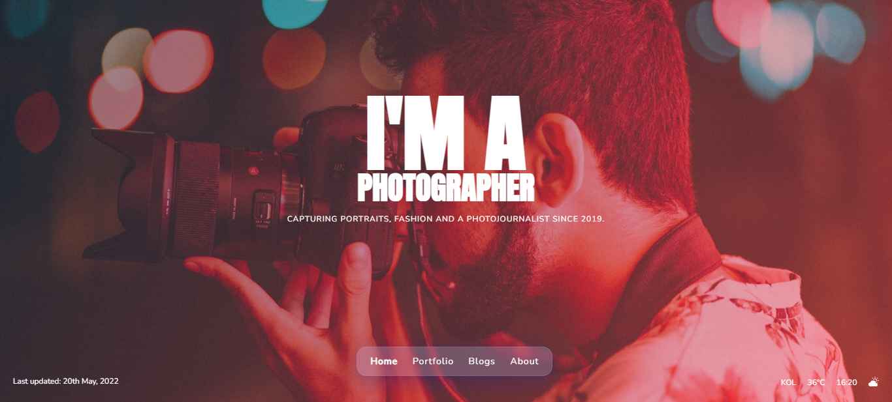

<h1 align="center">Photographer</h1>

<div align="center">
  A photographer's portfolio website demo
</div>
<div style="width: 100%;margin-top: 25px;">
  
</div>


### Built With

<!-- This section should list any major frameworks that you built your project using. Here are a few examples.-->

[ReactJS](https://reactjs.org/)<br/>
[Pixabay API](https://pixabay.com/)<br />


## How To Use

<!-- For example: -->

To clone and run this application, you'll need [Git](https://git-scm.com) and [Node.js](https://nodejs.org/en/download/) (which comes with [npm](http://npmjs.com)) installed on your computer. From your command line:

```bash
# Clone this repository
$ git clone https://github.com/RDKonqueror/Photographer

# Install dependencies
$ npm install react-router-dom

# Run the app
$ npm start
```


## Contact

- Website [rdkonqueror.wordpress.com](https://rdkonqueror.wordpress.com)
- GitHub [@rdkonqueror](https://github.com/RDKonqueror)
- Twitter [@rdkonqueror](https://twitter.com/rdkonqueror)
